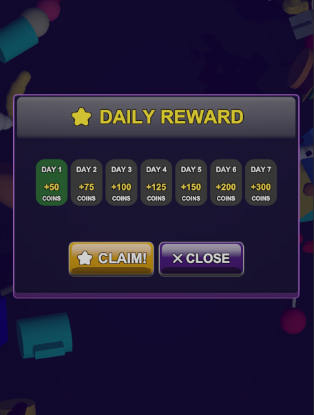
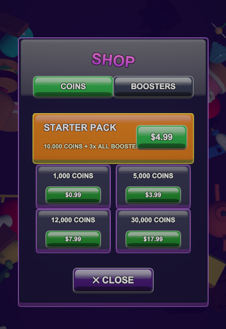

# 🧩 Match 3D: Production-Ready Hybrid-Casual Framework by Emir Bekar

---

## 📑 Table of Contents
1. [Visual Showcase](#-visual-showcase)
2. [3D Asset Pipeline & Rendering](#-3d-asset-pipeline--rendering)
3. [The Core Gameplay Loop](#-the-core-gameplay-loop)
4. [Deep Dive: Architecture & Optimization](#-deep-dive-architecture--optimization)
5. [LiveOps & Player Retention Systems](#-liveops--player-retention-systems)
6. [Future Roadmap](#-future-Roadmap)

---

## 📱 Visual Showcase

  

<i>Click the image to watch the full gameplay on YouTube</i>

### The Meta-Game Interface
Commercial success relies heavily on UI/UX and meta-game loops. The following systems were implemented to drive Day-1 to Day-7 retention:

| Daily Rewards | Shop | Lucky Spin |
| :---: | :---: | :---: |
|  <b>Progressive Daily Login</b> |  <b>In-game Shop</b> |  <b>Economy Sinks & Boosters</b> |

---

## 🎨 3D Asset Pipeline & Rendering

I handled the full technical art pipeline to ensure the visuals fit strict mobile constraints without sacrificing aesthetics.

  

<i>All 3D models were designed from scratch in Blender with a low-poly aesthetic.</i>

* **Draw Call Reduction:** All 3D items share a single unified texture atlas and a single material. This allows Unity's URP (Universal Render Pipeline) to batch the entire pile of objects into just a few draw calls.
* **Geometry Optimization:** Strict polygon budgets were maintained during the Blender modeling phase, ensuring smooth rendering on devices stretching back to the iPhone 8 era.

---

## 🎯 The Core Gameplay Loop

The fundamental mechanic requires players to find and match specific 3D objects from a massive, physics-enabled pile within a strict time limit. 
* **Tactile Feedback:** Utilizes Unity's physics engine for realistic object collisions, drag-and-drop mechanics, and satisfying clearing animations.
* **Dynamic Goals:** Goal conditions are fully modular, allowing designers to set multi-stage item collection targets.
* **Combo System:** A time-sensitive multiplier system that rewards fast playstyles, directly tied to the end-of-level score and soft currency generation.

---

## 🛠 Deep Dive: Architecture & Optimization

Developing a physics-heavy 3D game for lower-end Android and iOS devices presents significant CPU and memory challenges. Here is how I solved them:

### 1. Zero-Allocation Memory Management
Mobile device CPUs throttle heavily during Garbage Collection (GC) spikes. To combat this:
* **Dictionary-Backed Object Pooling:** All interactable items, visual FX, and floating UI texts (`FloatingText.cs`) are pooled. There are absolutely **zero `Instantiate()` or `Destroy()` calls** once the gameplay scene initializes.
* **String Allocation Avoidance:** UI updates avoid string concatenation in `Update()` loops. Score and timer displays use cached string builders or integer-based text updates.

### 2. Physics & CPU Throttling
* **Collision Matrices:** Custom layer collision matrices ensure that objects only calculate physics against the floor and each other, ignoring UI and out-of-bounds trigger zones.
* **Rigidbody Sleep Management:** Implemented logic to aggressively force rigidbodies to sleep when velocity drops below a threshold, freeing up CPU cycles for the main thread.

### 3. Faux-3D UI Rendering Strategy
* **Avoiding RenderTextures:** Instead of using expensive camera-to-render-texture setups for 3D UI elements (which break batching), I developed `GoalDisplay.cs`. This script strips physics/mesh colliders from standard 3D prefabs, scales them down, and renders them directly within the UI Canvas space using custom Z-depth sorting.

---

## 📈 LiveOps & Player Retention Systems

A game must retain players. I built several data-driven meta-systems to ensure a commercially viable product:

* **Adaptive Difficulty (Anti-Churn):** The game tracks consecutive player losses (`Loss Streak`). If a player struggles, the game silently intervenes by increasing the time limit and reducing the total number of "junk" objects in the next attempt.
* **Centralized Data Economy:** Implemented `LevelConfig.cs` (ScriptableObject). The entire game economy—booster costs, coin rewards, spawn distributions, and level timings—can be balanced from a single file without modifying code.
* **Unified Virtual Currency:** A fully functional soft currency loop where players earn coins through matches and spend them on in-game tactical boosters (Magnet, Freeze Timer, Undo Move, Shuffle, Extra Slot).
  
---

## 🚀 Future Roadmap

While the core mechanics and optimization frameworks are fully implemented, the following features are planned to transition the project from a vertical slice to a globally scalable product:

*   **Content Scaling & Curve Balancing:** Expanding the current level roster to 100+ stages utilizing the existing `LevelConfig` ScriptableObject architecture, introducing new 3D object sets modeled and optimized for varied visual themes.
*   **VFX & Environmental Polish:** Upgrading the visual feedback loop with advanced particle systems for combo clears, post-processing tweaks, and dynamic background environments to enhance the "satisfying" tactile feel.
*   **A/B Testing Infrastructure:** Integrating analytical hooks (e.g., Unity Analytics/GameAnalytics) to monitor player drop-off rates and A/B test the automated "Adaptive Difficulty" system.
*   **Audio & Soundscape Overhaul:** Transitioning from the current placeholder 8-bit audio framework to a fully licensed, high-fidelity sound system. This will include dynamic pitch shifting for combo multipliers and satisfying auditory feedback tailored to object interactions.

---
## Copyright & License

**Copyright (c) 2026 Emir Bekar. All rights reserved.**

This repository is public strictly for portfolio and demonstration purposes. 
The source code, 3D assets, and all related materials may not be copied, distributed, modified, or used for any commercial or non-commercial purposes without explicit written permission.
